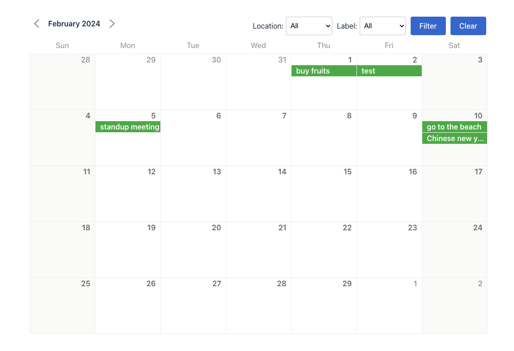
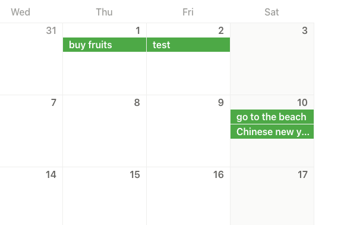
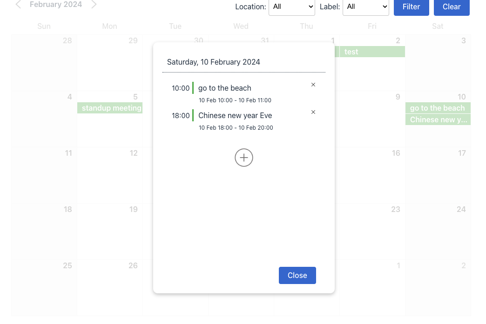
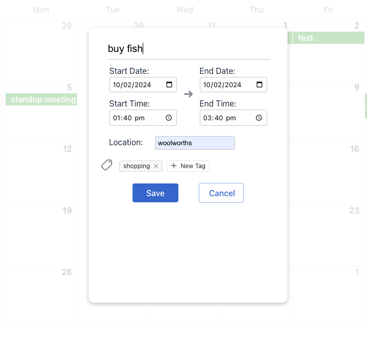
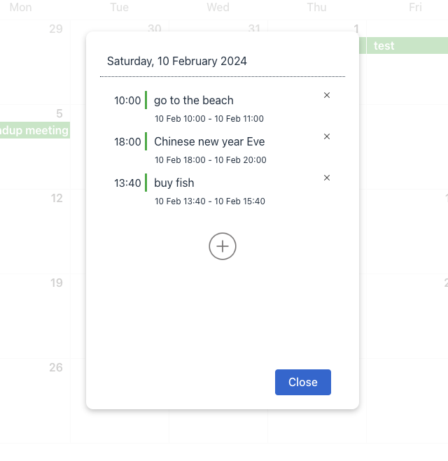
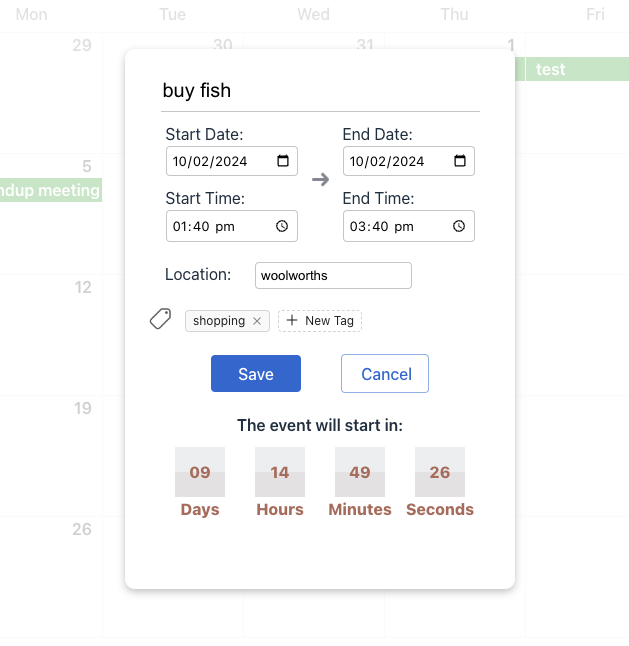
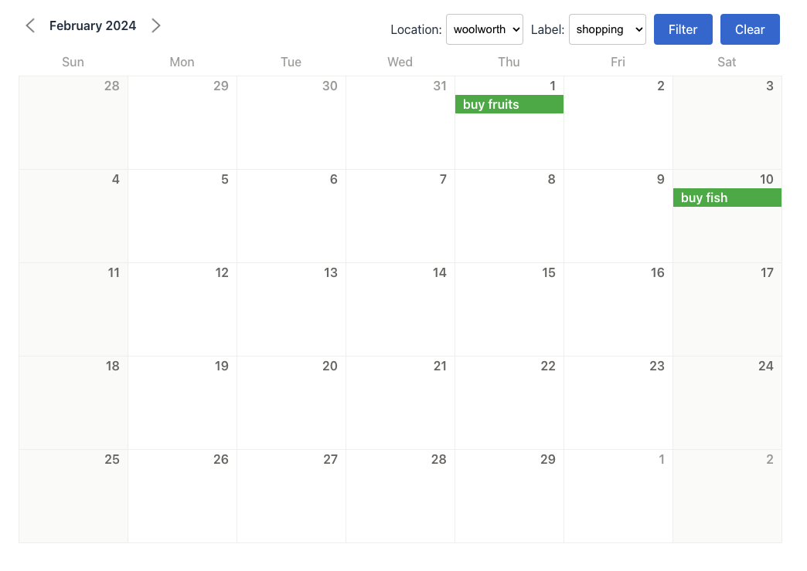

# Event-Calendar
This is a calendar application that allows the users to add, delete, update and check events on the calendar.

### 🚀 [Launch Live Event-Calendar App](https://gulama2008.github.io/events-calendar/)

## Table of Contents

- [Snippets](#snippets)
- [Tech Stack](#tech-stack)
- [Requirements](#requirements)
    - [MVP](#mvp)
- [Features](#features)
- [Future Goals](#future-goals)

## Snippets
 

## Tech Stack

- React
- Typescript
- SCSS
- axios
- Java
- Spring
- MySql

## Requirements
### MVP
Create a page that displays a calendar. The calendar should include a title showing the current month and a grid of days (Please note that you DO NOT have to use css grid to style it).

-   Each of the days cells should be clickable.
-   The user should be able to navigate between months - view the upcoming month, previous month etc.
-   When a user click on a chosen day, a modal should appear
-   The modal should include a form with the following fields:
    -   Event Name
    -   Start Date
    -   End date
    -   Location
    -   Label

-   When an event is created, a card component should be displayed on the corresponding date cell of the calendar.
-   The event card component should also be clickable and display a modal with event details and a countdown timer showing the time remaining until the event.
-   When a user tries to add an event with a start date in the past, an error message should appear.
-   The user should be able to filter the calendar by labels or location, allowing them to view specific events based on their preferences.

## Features

- This event-calendar application is a calendar which users can also add, delete, update and check events on it. The calendar app has the current month and year on the top left corner, a filter bar on the top right corner and the calendar below them. The calendar contains the dates of the current month and the days of the week on top, plus the last few dates from previous month and first few dates from next month to fill in the line fully. These dates which not belong to current month are shown with gray color and inactive.

- If there is event in a certain date, there will be a strip with green color and the title of the event in that date's grid, if there are more than one then it will be displayed line by line in the grid  

- When clicking a certain date, there will be a modal pop up with the date of the grid on top, below that all the event on that date will be shown with some of the details: the starting time, the title and the exact time and date duration. User can simply delete the event by clicking the "x". And there is an add button below the events, which users can click and add new event for that date

- After clicking the add event button, a different modal will shown, which is a form that users can fill in with the new event's details, including the title, the start and end date, start and end time, the location and tags. All the details will be saved to the database after click the save button. 

- After clicking the save button of the new event modal, it will return back to the event list modal, and the newest added event will also be in the list

- If the user click one of the existing event in the event list, an event details modal will shown. It has all the details of the event as when user create it, which can be edited here, and click the save button will save the changes. Plus if it is a past event, there is an event ended message at the bottom; and if it is a future event, there is a count down timer at the bottom showing the exact days, hours, minutes and seconds left till the event start  

- Back to the calendar page, the filter bar is used to filter the events by its location or label, when the user choose a certain location or/and label, the green strip event will be filtered and only those which satisfied the filter condition will be left on the calendar. When click the clear button, the filter will be removed and all the events will be shown on the calendar

## Known Issues 
 - I removed validation for filling in the new event form since there is a bug with it, so currently if any field is left empty the form won't be submitted, but there will be no error message reminding the user for the empty field
 - Sometimes there are some unexpected bugs like a new event won't shown in the list, users have to refresh the page, but such thing is not happening every time, it just happens rarely, I still haven't figure out why
 - The tags won't reset when adding a new event, the tags which user added for the last event will still be there, users have to delete it manually
## Future Goals
- Add validation on creating new event
- Fix the tags issue
- Fix the bugs